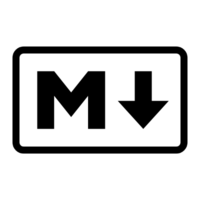
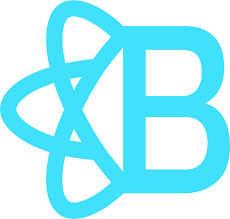
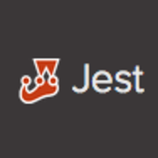
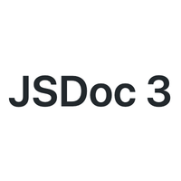
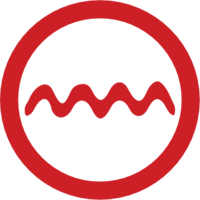

# Overview

> Like to LEARN, Love to SHARE, Happy to CODE.

    

        <h3>Design Tools</h3>
        
5+

        

            <button>art</button>
            <button>design</button>
            <button>photo edit</button>
        

    

    

        <h3>Tech Stacks</h3>
        
11+

        

            <button>languages</button>
            <button>frameworks</button>
            <button>libraries</button>
            <button>unit testing</button>
            <button>docs</button>
            <button>dev tools</button>
            <button>pkg managers</button>
        

    

    

        <h3>Business Tools</h3>
        
8+

        

            <button>IDE</button>
            <button>utility</button>
        

    

    

        <h3>Experience</h3>
        
14+

        

            <button>infosys</button>
            <button>skava</button>
            <button>astute</button>
            <button>cyber web</button>
        

    

    

        <h3>Education</h3>
        
3

        

            <button>SSLC</button>
            <button>diploma</button>
            <button>graduate</button>
        

    

    

        <h3>Awards</h3>
        
8+

        

            <button>star</button>
            <button>founder</button>
            <button>best employee</button>
            <button>distinguised</button>
        

    

    

        <h3>Own Libraries/Tools</h3>
        
14+

        

            <button>automation</button>
            <button>product</button>
            <button>js libs</button>
            <button>tools</button>
        

    

    

        <h3>Works</h3>
        
50+

        

            <button>art</button>
            <button>designs</button>
            <button>2D</button>
        

    

# Design Tools

> Software design tools that I have used for desktop/mobile/tablet web applications designs, poster, abstract designs and digital arts.

    

        
        
Photoshop

    

    

        
        
XD

    

    

        
        
Sketch

    

    

        
        
Flash

    

    

        
        
Autodesk

    

    

        
        
Lightroom

    

# Tech Stacks

> Tech stacks that I have worked/used for developing desktop/mobile/tablet web applications, libraries, build systems, tools etc.,

#### # Languages

    

        
        
HTML

    

    

        
        
CSS

    

    

        
        
JS/ES5

    

    

        
        
JS/ES6+

    

    

        
        
Typescript

    

     

        
        
NodeJS

    

    

        
        
FTL

    

    

        
        
XML

    

    

        
        
Handlebars

    

    

        
        
GraphQL

    

    

        
        
Markdown

    

    

        
        
SASS

    

    

        
        
YAML

    

    

        
        
AS3

    

#### # Frameworks

    

        
        
CRA

    

    

        
        
Next.js

    

    

        
        
Material UI

    

    

        
        
MDB React

    

    

        
        
React Bootstrap

    

#### # Libraries

    

        
        
React

    

    

        
        
Redux

    

    

        
        
Mobx

    

    

        
        
Styled Components

    

    

        
        
Webpack

    

    

        
        
Rollup

    

    

        
        
jQuery

    

    

        
        
jQuery UI

    

    

        
        
Express.js

    

    

        
        
Apollo Link State

    

others: **isomorphic-fetch, axios, next_i18next**

#### # Unit Testing

    

        
        
Jest

    

    

        
        
Cypress

    

    

        
        
Puppeteer

    

    

        
        
React Testing Library

    

#### # Docs

    

        
        
Docsify

    

    

        
        
Markdown

    

    

        
        
JS Docs

    

#### # Dev Tools

    

        
        
GIT

    

    

        
        
Babel

    

    

        
        
Prettier

    

    

        
        
Editor Config

    

    

        
        
Make

    

    

        
        
ES Lint

    

    

        
        
TS Lint

    

    

        
        
Sonar Lint

    

    

        
        
Storybook

    

#### # Package Managers

    

        
        
Yarn

    

    

        
        
NPM

    

    

        
        
Verdaccio

    

    

        
        
Lerna

    

# Business Tools

#### # IDE

    

        
        
VS Code

    

    

        
        
Sublime

    

    

        
        
Eclipse

    

    

        
        
Notepad++

    

#### # Utility/Others

    

        
        
Code sandbox

    

    

        
        
JIRA

    

    

        
        
Confluence

    

    

        
        
Trello

    

    

        
        
GitLab

    

    

        
        
G Drive

    

    

        
        
Bitbucket

    

    

        
        
Tortoise Git

    

    

        
        
Tower

    

    

        
        
Git Hub

    

    

        
        
Source Tree

    

# Experience

# Education

# Awards

# Own Libraries/Tools

# Works

